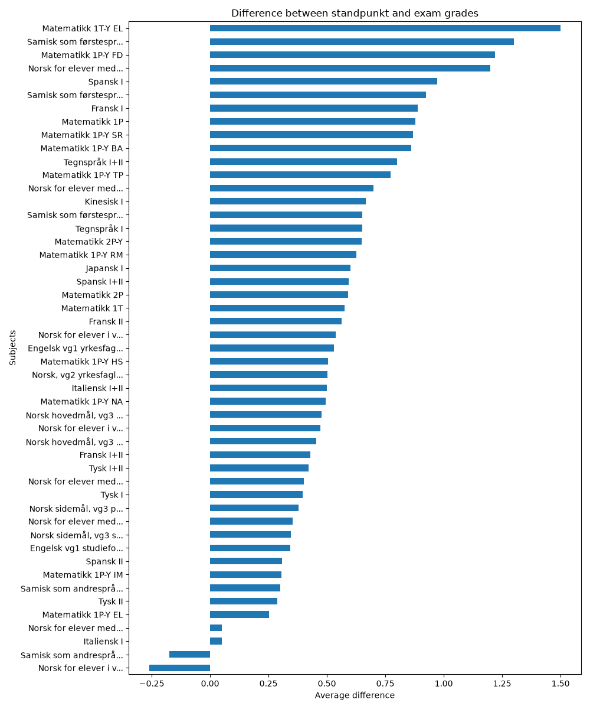
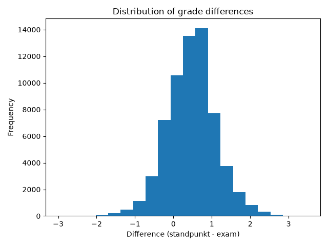

# Python Arbeidskrav - Mini Project 2


A small Python data analysis project from my bachelor in cybersecurity at Kristiania.
It looks at the gap between **standpunkt grades** (teacher-assessed) and **written exam
grades** in Norwegian upper secondary schools (VGS), using the public grade statistics
from UDIR.

## Problem

There is an ongoing public debate about whether teacher-assessed grades (standpunkt) are
systematically higher than exam grades. This project checks, for the 2024-25 school year,
whether that gap exists in the data and how it varies between subjects.

## Data

Public grade statistics from UDIR (no personal data, only averages per county and subject):
https://www.udir.no/tall-og-forskning/statistikk/statistikk-videregaende-skole/karakterer-vgs/

- `standpunkt_grades_vgs.csv` - average standpunkt grades
- `skriftlig_grades_vgs.csv` - average written exam grades

## What the script does

1. Loads both CSV files (semicolon separated, Latin-1 encoded)
2. Cleans column names and keeps only county, subject and grade
3. Converts grades to numbers (`4,5` to `4.5`) and drops missing values
4. Merges the two tables on county and subject
5. Computes the difference (standpunkt minus exam) overall and per subject
6. Saves two charts to the `graphs/` folder

## Findings

The average difference is about **+0.47**, so standpunkt grades are generally higher than
written exam grades. Most subjects show a positive gap, a few are close to zero or slightly
negative, and the size of the gap depends on the subject.

| Difference by subject | Distribution |
|---|---|
|  |  |

## Run it

```bash
git clone https://github.com/t4lh8/Python-Arbeidskrav-Mini-Project-2.git
cd Python-Arbeidskrav-Mini-Project-2
pip install -r requirements.txt
python miniproject2.py
```

The output is printed to the console, and the charts are written to `graphs/`.

## What I learned

- Loading and cleaning real, messy CSV data with **pandas**
- Handling decimal commas, missing values and merging tables
- Grouping and basic analysis with `groupby`
- Simple visualization with **matplotlib** (bar chart and histogram)

## License

[MIT](LICENSE)

Made by **Talha Aker**.
